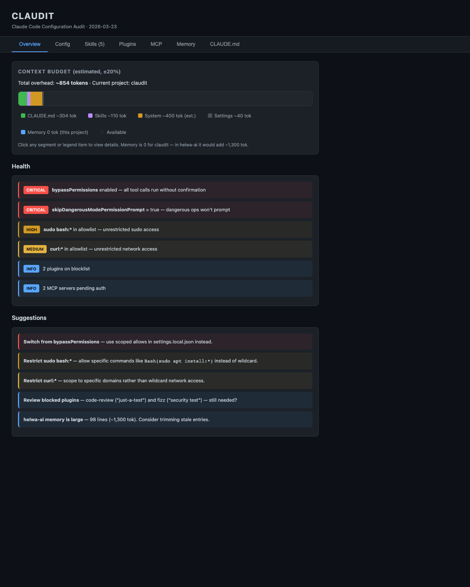

# Claudit

A Claude Code skill that audits your `~/.claude/` configuration and generates an interactive HTML dashboard.

## The Problem

Claude Code silently configures settings, skills, plugins, MCP servers, memory, and CLAUDE.md prompts across `~/.claude/`. Over time, you lose track of what's active, what's eating your context window, and what might be a security risk.

## Screenshot



## What You Get

Run `/claudit` in any Claude Code session. It reads your config files and generates a self-contained HTML dashboard:

**Overview tab (default):**
- Context budget — color-coded stacked bar showing what's consuming your context window. Click any segment to drill into that section.
- Health audit — severity-rated security warnings (CRITICAL/HIGH/MEDIUM/INFO)
- Optimization suggestions — actionable recommendations

**Detail tabs:**
- **Config** — settings.json + permission overrides at a glance
- **Skills** — every installed skill with its description
- **Plugins** — installed and blocked plugins
- **MCP Servers** — connected servers and auth status
- **Memory** — per-project memory files (summarized, never raw)
- **CLAUDE.md** — your global and project-level instructions

## Security

- Credentials, tokens, passwords, and secrets are **never** included in the HTML
- Memory files are **summarized** by topic, not dumped raw
- The HTML is written to `/tmp/` (ephemeral)
- No external dependencies, no network requests, no telemetry
- Everything runs locally in your Claude Code session

## Install

```bash
# Clone into your projects directory
git clone https://github.com/teajuw/claudit.git ~/projects/claudit

# Copy the skill to your Claude skills directory
cp -r ~/projects/claudit/skills/claudit ~/.claude/skills/claudit
```

Or manually: copy the `skills/claudit/` folder into `~/.claude/skills/`.

That's it. No dependencies, no build step, no configuration.

## Usage

```
/claudit                    # audit from current directory
/claudit ~/projects/myapp   # audit a specific project
```

The optional path argument changes which project's memory and CLAUDE.md are shown in the context budget. Global config (settings, skills, plugins, MCP) is always the same — it's the project-specific overhead that changes.

The skill will:
1. Print progress updates as it reads your config files
2. Generate a self-contained HTML dashboard
3. Open it in your browser
4. Print the file path so you can reopen it later

## What It Reads

| File | Required | What it shows |
|------|----------|---------------|
| `~/.claude/settings.json` | Yes | Permission mode, effort level, voice, updates, plugins |
| `~/.claude/settings.local.json` | No | Permission overrides (allowed bash commands) |
| `~/.claude/CLAUDE.md` | No | Global behavior instructions |
| `~/.claude/skills/*/SKILL.md` | No | Installed skills with descriptions |
| `~/.claude/plugins/installed_plugins.json` | No | Installed plugins |
| `~/.claude/plugins/blocklist.json` | No | Blocked plugins |
| `~/.claude/mcp-needs-auth-cache.json` | No | MCP server auth status |
| `~/.claude/projects/` | No | Project listing and memory files |

Missing files are handled gracefully — the dashboard shows "none found" for empty sections.

## Health Checks

The audit flags common security concerns:

| Severity | Check |
|----------|-------|
| CRITICAL | `bypassPermissions` enabled |
| CRITICAL | `skipDangerousModePermissionPrompt` = true |
| HIGH | `sudo` in permission allowlist |
| MEDIUM | Unrestricted `curl` in allowlist |
| INFO | Blocked plugins, pending MCP auth |

## Context Budget

The stacked bar chart estimates how much of your context window is consumed by configuration overhead:

- **CLAUDE.md** — global + project instructions
- **Skills** — frontmatter descriptions from all installed skills
- **System reminders** — auto-injected by Claude Code (~400 tok estimated)
- **Settings** — configuration injection
- **Memory** — project-specific MEMORY.md files (varies by project)

The dashboard detects your active model (Opus 4.6, Sonnet 4.6, Haiku 4.5) and shows context usage as a percentage of the model's actual token limit (1M for Opus 1M, 200K for standard models).

Token estimation uses a word count × 1.3 heuristic (±20% accuracy).

## License

MIT
